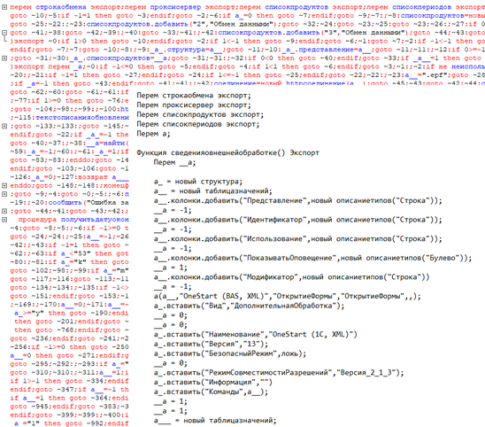
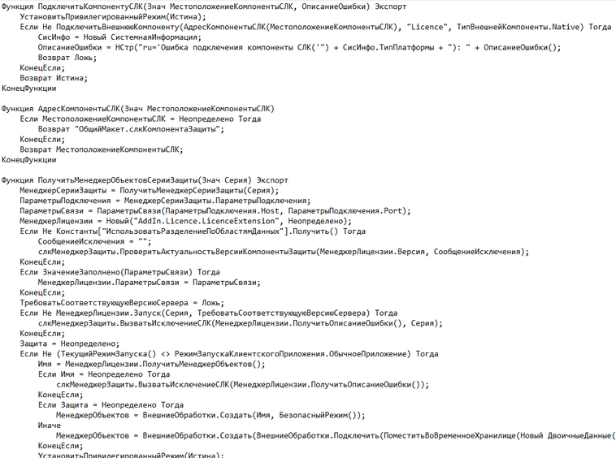

# BSL Decompiler

[Eng](#english) · [Rus](#русский)

## BSL Decompiler

BSL Decompiler is a command-line tool for analyzing, deobfuscating, and
reconstructing compiled-only 1C:Enterprise BSL modules. It also provides a
separate restoration mode for already extracted textual BSL.

Only modules classified as `compiled_only` are written by the `disasm` and
`decompile` commands. Modules that already contain source code are reported by
`scan` but are not copied to the output directory.

## Deobfuscate example


## Decompilation example


### Features

- 1C container and module discovery;
- compiled-module disassembly;
- control-flow reconstruction;
- symbolic analysis and conservative dead-branch removal;
- BSL deobfuscation and source reconstruction;
- textual BSL restoration without a container;
- x64 and x32 Windows command-line builds.

### Supported input

- 1C:Enterprise `CF`, `CFE`, `EPF`, and `ERF` containers supported by the
  bundled container layer;
- extracted compiled module images;
- `.bsl` and `.txt` files for the `restore` command.

### Quick start

```powershell
bsl-decompiler-x64.exe scan configuration.cf
bsl-decompiler-x64.exe decompile configuration.cf output --engine cfg
bsl-decompiler-x64.exe restore module.bsl -o module.restored.bsl
bsl-decompiler-x64.exe decompile /?
```

See [Installation](docs/installation.md) and [Usage](docs/usage.md) for the
complete public documentation.

### CFG engine and diagnostic output

```powershell
bsl-decompiler-x64.exe decompile configuration.cf output `
  --engine cfg `
  --dump-cfg `
  --dump-ir `
  --dump-ssa
```

- `--engine cfg` selects the CFG-based reconstruction pipeline:
  bytecode → CFG → symbolic execution → IR → SSA → AST → BSL. It reconstructs
  control-flow constructs conservatively and preserves labels and jumps when a
  safe structure cannot be proved.
- `--dump-cfg` writes `Module.v2.cfg.dot`, a Graphviz representation of basic
  blocks and control-flow edges.
- `--dump-ir` writes `Module.ir.txt` with the intermediate operations and
  `Module.ast.json` with the reconstructed BSL syntax tree before printing.
- `--dump-ssa` writes `Module.ssa.txt` with variable versions, merge points,
  and unresolved Phi values.

The `--dump-*` options create diagnostic files and do not by themselves change
the reconstructed BSL. They are primarily intended for troubleshooting and
decompiler analysis. As with the regular `decompile` command, artifacts are
created only for modules classified as `compiled_only`.

### Download

Ready-to-use binaries and `SHA256SUMS.txt` are distributed through the
[GitHub Releases page](../../releases). Release binaries are not stored in the
main branch.

### Component boundary

```text
1C CF / CFE / EPF / ERF
          |
          v
saby v8unpack 1.2.11       container processing
          |
          v
BSL Decompiler             module and bytecode analysis
          |
          v
CFG / symbolic analysis / deobfuscation / BSL reconstruction
```

### Third-party components

BSL Decompiler uses **saby v8unpack 1.2.11** as the container-processing
layer for supported 1C:Enterprise binary formats. v8unpack is an independent
third-party project licensed under the MIT License and is not the BSL
decompiler, CFG analyzer, or symbolic analysis engine.

Official project: [saby-integration/v8unpack](https://github.com/saby-integration/v8unpack)

See [THIRD_PARTY_NOTICES.md](THIRD_PARTY_NOTICES.md) for attribution and
license information.

### License and disclaimer

BSL Decompiler is proprietary software. The distributed binary version may be
used subject to the terms in [LICENSE](LICENSE); the source code is not
publicly distributed under that license. Third-party components remain subject
to their respective licenses.

The software is provided **AS IS**, without warranties of any kind. Use is
entirely at the user's own risk. To the maximum extent permitted by applicable
law, the author and distributors shall not be liable for damages, losses, data
loss, lost profits, business interruption, or other consequences arising from
use of or inability to use the software.

## Декомпилятор BSL

BSL Decompiler — консольный инструмент для анализа, деобфускации и
восстановления compiled-only модулей BSL платформы 1С:Предприятие. Также
предусмотрен отдельный режим восстановления уже извлечённого текстового BSL.

Команды `disasm` и `decompile` сохраняют только модули, классифицированные как
`compiled_only`. Модули с доступным исходным текстом отображаются командой
`scan`, но не копируются в каталог результата.

### Возможности

- обнаружение контейнеров и модулей 1С;
- дизассемблирование скомпилированных модулей;
- восстановление потока управления;
- символьный анализ и консервативное удаление доказанно мёртвых ветвей;
- деобфускация и восстановление исходного BSL;
- восстановление текстового BSL без контейнера;
- консольные сборки Windows x64 и x32.

### Поддерживаемые входные данные

- контейнеры 1С:Предприятия `CF`, `CFE`, `EPF` и `ERF`, поддерживаемые
  встроенным слоем обработки контейнеров;
- извлечённые образы скомпилированных модулей;
- файлы `.bsl` и `.txt` для команды `restore`.

### Быстрый старт

```powershell
bsl-decompiler-x64.exe scan configuration.cf
bsl-decompiler-x64.exe decompile configuration.cf output --engine cfg
bsl-decompiler-x64.exe restore module.bsl -o module.restored.bsl
bsl-decompiler-x64.exe decompile /?
```

Подробности приведены в документах [Установка](docs/installation.md) и
[Использование](docs/usage.md).

### CFG-движок и диагностические файлы

```powershell
bsl-decompiler-x64.exe decompile configuration.cf output `
  --engine cfg `
  --dump-cfg `
  --dump-ir `
  --dump-ssa
```

- `--engine cfg` выбирает конвейер восстановления на основе CFG:
  bytecode → CFG → символьное исполнение → IR → SSA → AST → BSL. Он
  консервативно восстанавливает управляющие конструкции, а если безопасность
  преобразования не доказана — сохраняет метки и переходы.
- `--dump-cfg` создаёт `Module.v2.cfg.dot` — граф базовых блоков и переходов в
  формате Graphviz.
- `--dump-ir` создаёт `Module.ir.txt` с промежуточными операциями и
  `Module.ast.json` с восстановленным синтаксическим деревом BSL перед печатью.
- `--dump-ssa` создаёт `Module.ssa.txt` с версиями переменных, точками слияния
  и неразрешёнными значениями Phi.

Параметры `--dump-*` создают только диагностические файлы и сами по себе не
изменяют восстановленный BSL. Они предназначены прежде всего для поиска причин
ошибок декомпиляции. Как и обычная команда `decompile`, они создают артефакты
только для модулей с классификацией `compiled_only`.

### Загрузка

Готовые бинарные сборки и `SHA256SUMS.txt` публикуются на странице
[GitHub Releases](../../releases). Бинарные файлы релизов не хранятся в
основной ветке.

### Разделение компонентов

`saby v8unpack 1.2.11` отвечает за обработку контейнеров 1С. Анализ модулей и
байткода, построение CFG, символьный анализ, деобфускация и восстановление BSL
реализованы отдельно в BSL Decompiler.

Официальный проект: [saby-integration/v8unpack](https://github.com/saby-integration/v8unpack)

### Лицензия и отказ от гарантий

BSL Decompiler является проприетарным программным обеспечением. Использование
распространяемой бинарной версии регулируется файлом [LICENSE](LICENSE).
Исходный код по этой лицензии публично не распространяется. Сторонние
компоненты регулируются собственными лицензиями.

Программа предоставляется **«КАК ЕСТЬ»**, без каких-либо гарантий. Пользователь
использует её на свой риск. В максимальной степени, допускаемой применимым
законодательством, автор и распространители не отвечают за ущерб, потери
данных, упущенную выгоду, перерывы в работе и иные последствия использования
или невозможности использования программы.
